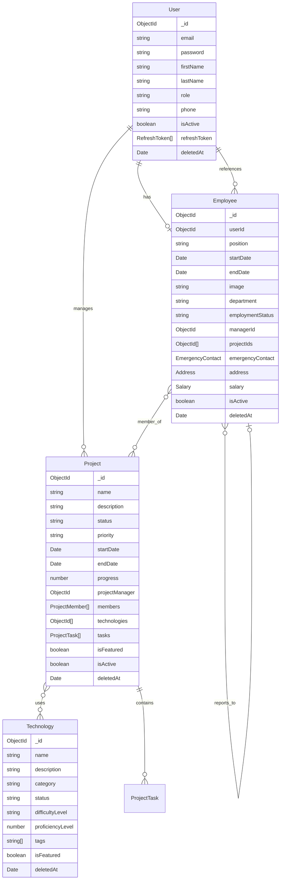

# SillaLink NestJS Server Architecture

## Overview

This document describes the comprehensive modular architecture of the SillaLink NestJS server. The system has been restructured into isolated, self-contained modules following Domain-Driven Design (DDD) principles and NestJS best practices.

## Architecture Principles

- **Modular Design**: Each business domain is encapsulated in its own module
- **Separation of Concerns**: Clear boundaries between API, business logic, and data layers
- **Dependency Injection**: Leveraging NestJS's powerful DI container
- **Scalability**: Easy to add new modules and features
- **Maintainability**: Consistent structure across all modules

## Module Structure Standard

Every module follows this consistent directory structure:

```
src/modules/{module-name}/
├── api/
│   ├── controllers/          # HTTP controllers (admin & public)
│   ├── dto/                  # Data Transfer Objects
│   │   ├── request/          # Request DTOs
│   │   └── response/         # Response DTOs (optional)
│   └── validation/           # Custom validation pipes
├── database/
│   ├── schemas/              # Mongoose schemas
│   └── repositories/         # Data access layer
├── services/                 # Business logic services
├── interfaces/               # TypeScript interfaces & enums
├── {module-name}.module.ts   # NestJS module definition
└── index.ts                  # Module exports
```

## Core Modules

### 1. Auth System (`auth-system`)
**Purpose**: Authentication, authorization, and security management

**Key Components**:
- JWT token management (access & refresh tokens)
- User registration and login flows
- OTP verification system
- Admin authentication
- Password reset functionality

**Controllers**:
- `AuthController` - Public authentication endpoints
- `AuthControllerWithToken` - Protected authentication endpoints
- `AuthAdminController` - Admin authentication
- `RefreshController` - Token refresh management

**Services**:
- `AuthService` - Main authentication logic
- `AuthAdminService` - Admin-specific authentication
- `AuthError` - Centralized error handling

### 2. User Management (`user-management`)
**Purpose**: Core user entity management and CRUD operations

**Key Components**:
- User profile management
- User roles and permissions
- Account activation/deactivation
- User search and filtering

**Schema**: `User` - Core user entity with authentication fields
**Repository**: `UserRepository` - User data access operations
**Service**: `UserService` - User business logic

### 3. Employee Management (`employee-management`)
**Purpose**: Employee-specific data and operations

**Key Components**:
- Employee profiles linked to users
- Department and role management
- Manager-employee relationships
- Salary and contact information
- Employment status tracking

**Schema**: `Employee` - Employee entity referencing User
**Repository**: `EmployeeRepository` - Employee data operations
**Service**: `EmployeeService` - Employee business logic

### 4. Project Management (`project-management`)
**Purpose**: Project lifecycle and task management

**Key Components**:
- Project creation and management
- Task assignment and tracking
- Team member management
- Project status and progress tracking
- Technology stack association

**Schema**: `Project` - Project entity with embedded tasks and members
**Repository**: `ProjectRepository` - Project data operations
**Service**: `ProjectService` - Project business logic

### 5. Technology Management (`technology-management`)
**Purpose**: Technology stack and skill management

**Key Components**:
- Technology catalog management
- Proficiency level tracking
- Learning resource management
- Technology categorization

**Schema**: `Technology` - Technology entity with metadata
**Repository**: `TechnologyRepository` - Technology data operations
**Service**: `TechnologyService` - Technology business logic

### 6. Service Management (`service-management`)
**Purpose**: Business service offerings management

**Key Components**:
- Service catalog management
- Pricing and feature management
- Service categorization
- Order and rating tracking

**Schema**: `Service` - Service entity with pricing and features
**Repository**: `ServiceRepository` - Service data operations
**Service**: `ServiceService` - Service business logic

### 7. Health Monitoring (`health-monitoring`)
**Purpose**: System health and monitoring

**Key Components**:
- Database connectivity checks
- Redis connectivity monitoring
- System resource monitoring
- Health status reporting

**Controller**: `HealthController` - Health check endpoints
**Service**: `HealthService` - Health monitoring logic

## API Endpoint Organization

### Admin Routes (`/api/v1/admin/`)
Protected routes requiring admin authentication and authorization:

```
/api/v1/admin/
├── auth/                     # Admin authentication
├── users/                    # User management
├── employees/                # Employee management
├── projects/                 # Project management
├── technologies/             # Technology management
└── services/                 # Service management
```

### Public/Website Routes (`/api/v1/website/`)
Public-facing routes for client applications:

```
/api/v1/website/
├── auth/                     # Public authentication
├── employees/public          # Public employee profiles
├── projects/                 # Public project showcase
└── services/                 # Public service catalog
```

### System Routes (`/api/v1/`)
System-level endpoints:

```
/api/v1/
├── health/                   # Health monitoring
└── upload/                   # File upload services
```

## Database Schema Relationships

### Core Entities



## Error Code Ranges

Each module has its own error code range to prevent conflicts:

| Module | Error Code Range | Examples |
|--------|------------------|----------|
| Auth System | 4000-4999 | 4001: OTP_EXPIRED, 4003: INVALID_CREDENTIALS |
| User Management | 2000-2999 | 2001: USER_NOT_FOUND, 2002: USER_ALREADY_EXISTS |
| Employee Management | 3000-3999 | 3001: EMPLOYEE_NOT_FOUND, 3002: EMPLOYEE_ALREADY_EXISTS |
| Project Management | 5000-5999 | 5001: PROJECT_NOT_FOUND, 5005: MEMBER_ALREADY_EXISTS |
| Technology Management | 6000-6999 | 6001: TECHNOLOGY_NOT_FOUND, 6003: INVALID_PROFICIENCY_LEVEL |
| Service Management | 7000-7999 | 7001: SERVICE_NOT_FOUND, 7002: SERVICE_ALREADY_EXISTS |
| Email Services | 60000-60999 | 60001: MAIL_ERROR |
| Validation | 70000-70999 | 70000: VALIDATION_ERROR |

## Module Dependencies

### Dependency Graph

```
┌─────────────────┐    ┌──────────────────┐
│   Auth System   │───▶│ User Management  │
└─────────────────┘    └──────────────────┘
                                │
                                ▼
┌─────────────────┐    ┌──────────────────┐
│Employee Mgmt    │◀───┤                  │
└─────────────────┘    │                  │
                       │                  │
┌─────────────────┐    │                  │
│Project Mgmt     │◀───┤                  │
└─────────────────┘    │                  │
         │             │                  │
         ▼             │                  │
┌─────────────────┐    │                  │
│Technology Mgmt  │◀───┘                  │
└─────────────────┘                       │
                                          │
┌─────────────────┐                       │
│Service Mgmt     │◀──────────────────────┘
└─────────────────┘

┌─────────────────┐
│Health Monitor   │ (Independent)
└─────────────────┘
```

### Import Rules

1. **Core modules** (User Management, Auth System) should not depend on business modules
2. **Business modules** can depend on core modules but not on each other
3. **Shared packages** can be used by any module
4. **Cross-module communication** should go through services, not direct imports

## Adding New Modules

### Step-by-Step Guide

1. **Create Module Structure**:
```bash
mkdir -p src/modules/new-module/{api/{controllers,dto/request,validation},database/{schemas,repositories},services,interfaces}
```

2. **Create Core Files**:
```typescript
// new-module.module.ts
import { Module } from '@nestjs/common';
import { MongooseModule } from '@nestjs/mongoose';
import { NewModuleController } from './api/controllers/new-module.controller';
import { NewModuleService } from './services/new-module.service';
import { NewModuleRepository } from './database/repositories/new-module.repository';
import { NewModule, NewModuleSchema } from './database/schemas/new-module.schema';

@Module({
  imports: [
    MongooseModule.forFeature([{ name: NewModule.name, schema: NewModuleSchema }])
  ],
  controllers: [NewModuleController],
  providers: [NewModuleService, NewModuleRepository],
  exports: [NewModuleService, NewModuleRepository]
})
export class NewModuleModule {}
```

3. **Define Schema**:
```typescript
// database/schemas/new-module.schema.ts
import { Prop, Schema, SchemaFactory } from '@nestjs/mongoose';
import { Document } from 'mongoose';

export type NewModuleDocument = NewModule & Document;

@Schema({ timestamps: true })
export class NewModule {
  @Prop({ required: true })
  name: string;

  @Prop({ default: false })
  isDeleted: boolean;

  @Prop({ default: null })
  deletedAt?: Date;
}

export const NewModuleSchema = SchemaFactory.createForClass(NewModule);
```

4. **Create Repository**:
```typescript
// database/repositories/new-module.repository.ts
import { Injectable } from '@nestjs/common';
import { BaseMongoRepository } from '@Package/database/mongodb';
import { NewModule } from '../schemas/new-module.schema';
import { InjectModel } from '@nestjs/mongoose';
import { Model } from 'mongoose';

@Injectable()
export class NewModuleRepository extends BaseMongoRepository<NewModule> {
  constructor(
    @InjectModel(NewModule.name)
    private readonly newModuleModel: Model<NewModule>,
  ) {
    super(newModuleModel);
  }
}
```

5. **Create Service**:
```typescript
// services/new-module.service.ts
import { Injectable } from '@nestjs/common';
import { NewModuleRepository } from '../database/repositories/new-module.repository';

@Injectable()
export class NewModuleService {
  constructor(
    private readonly newModuleRepository: NewModuleRepository
  ) {}
}
```

6. **Create Controller**:
```typescript
// api/controllers/new-module.controller.ts
import { Controller, Get } from '@nestjs/common';
import { NewModuleService } from '../../services/new-module.service';

@Controller('new-module')
export class NewModuleController {
  constructor(private readonly newModuleService: NewModuleService) {}

  @Get()
  async findAll() {
    return this.newModuleService.findAll();
  }
}
```

7. **Add to Main Module**:
```typescript
// Update src/modules/index.ts
import { NewModuleModule } from './new-module/new-module.module';

export const Modules = [
  // ... existing modules
  NewModuleModule
];
```

8. **Assign Error Code Range**:
   - Choose next available range (e.g., 8000-8999)
   - Update error-code.ts with new codes
   - Create error service following the pattern

## Naming Conventions

### Files and Directories
- **Modules**: `kebab-case` (e.g., `user-management`, `auth-system`)
- **Files**: `kebab-case.type.ts` (e.g., `user.service.ts`, `auth.controller.ts`)
- **Classes**: `PascalCase` (e.g., `UserService`, `AuthController`)
- **Interfaces**: `PascalCase` with `I` prefix (e.g., `IUserRepository`)
- **Enums**: `PascalCase` (e.g., `UserRole`, `ProjectStatus`)
- **Constants**: `UPPER_SNAKE_CASE` (e.g., `ERROR_CODES`, `DEFAULT_LIMIT`)

### API Endpoints
- **Admin routes**: `/api/v1/admin/{resource}`
- **Public routes**: `/api/v1/website/{resource}`
- **System routes**: `/api/v1/{resource}`
- **Resource naming**: Use plural nouns (e.g., `users`, `projects`, `technologies`)

### Database
- **Collections**: Singular nouns (e.g., `user`, `project`, `technology`)
- **Fields**: `camelCase` (e.g., `firstName`, `createdAt`, `isActive`)
- **References**: `{entity}Id` (e.g., `userId`, `projectId`)

## Security Considerations

### Authentication & Authorization
- **JWT Tokens**: Access tokens (short-lived) + Refresh tokens (long-lived)
- **Role-based Access**: Admin, Operator, User, Employee roles
- **Route Protection**: Guards for admin and authenticated routes
- **Rate Limiting**: Applied to sensitive endpoints

### Data Protection
- **Password Hashing**: bcrypt with salt rounds
- **Sensitive Data**: Excluded from query results automatically
- **Input Validation**: DTOs with validation pipes
- **CSRF Protection**: Enabled for state-changing operations

### Error Handling
- **Centralized Errors**: Module-specific error services
- **No Data Leakage**: Generic error messages for production
- **Logging**: Comprehensive error logging with context

## Performance Optimizations

### Database
- **Indexes**: Strategic indexing on frequently queried fields
- **Pagination**: Implemented across all list endpoints
- **Population**: Selective field population to reduce payload
- **Aggregation**: Used for complex queries and statistics

### Caching
- **Redis Integration**: Session storage and caching layer
- **Query Caching**: Frequently accessed data cached
- **Rate Limiting**: Redis-based rate limiting

### API Design
- **Lazy Loading**: Data loaded on demand
- **Selective Fields**: Option to specify required fields
- **Batch Operations**: Support for bulk operations where applicable

## Monitoring & Observability

### Health Checks
- **Database Connectivity**: MongoDB connection status
- **Cache Connectivity**: Redis connection status
- **System Resources**: Memory and CPU usage monitoring
- **Custom Metrics**: Business-specific health indicators

### Logging
- **Structured Logging**: JSON-formatted logs with context
- **Log Levels**: Debug, Info, Warn, Error levels
- **Request Tracing**: Request ID tracking across services
- **Error Tracking**: Comprehensive error logging with stack traces

## Development Guidelines

### Code Quality
- **TypeScript**: Strict type checking enabled
- **ESLint**: Code style and quality enforcement
- **Prettier**: Consistent code formatting
- **Testing**: Unit tests for services, integration tests for controllers

### Git Workflow
- **Feature Branches**: One feature per branch
- **Commit Messages**: Conventional commit format
- **Code Reviews**: Required for all changes
- **CI/CD**: Automated testing and deployment

### Documentation
- **API Documentation**: Swagger/OpenAPI integration
- **Code Comments**: JSDoc for public APIs
- **README Updates**: Keep module READMEs current
- **Architecture Updates**: Update this document for structural changes

## Migration Guide

### From Legacy Structure
If migrating from the old module structure:

1. **Backup**: Create full backup of existing code
2. **Module by Module**: Migrate one module at a time
3. **Test Thoroughly**: Ensure all functionality works after migration
4. **Update Imports**: Fix all import paths to new structure
5. **Database**: No schema changes required for most modules
6. **Environment**: Update any environment-specific configurations

### Breaking Changes
- **Import Paths**: All module imports need updating
- **Error Codes**: Some error codes have changed ranges
- **API Structure**: Admin vs public route separation
- **Schema Separation**: User and Employee are now separate entities

## Troubleshooting

### Common Issues
1. **Module Not Found**: Check import paths and module exports
2. **Circular Dependencies**: Ensure proper dependency hierarchy
3. **Database Connection**: Verify MongoDB and Redis connectivity
4. **Authentication Errors**: Check JWT configuration and token validity
5. **Build Errors**: Ensure all TypeScript types are properly defined

### Debug Tools
- **Health Endpoints**: Use `/api/v1/health` for system status
- **Logging**: Check application logs for detailed error information
- **Database Tools**: Use MongoDB Compass for database inspection
- **Redis Tools**: Use Redis CLI for cache inspection

---

## Conclusion

This modular architecture provides a scalable, maintainable foundation for the SillaLink application. Each module is self-contained while following consistent patterns, making it easy for developers to understand, extend, and maintain the codebase.

For questions or clarifications about this architecture, please refer to the individual module documentation or contact the development team.
